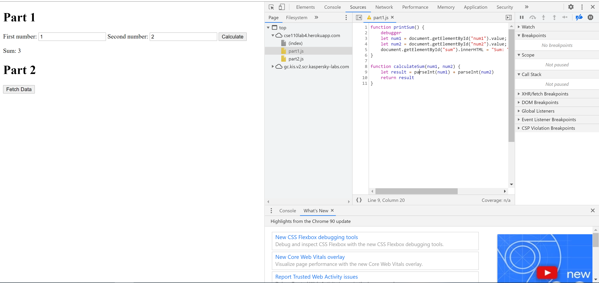

1. The bug is if you add 2 numbers together, the output will concatenate the 2
2. 
3. citylots.json
4. part2.js file has a function that initiated the download of citylot.json
5. 81.55 ms
6. 11.68 MB
7. Mozilla/5.0 (Windows NT 10.0; Win64; x64) AppleWebKit/537.36 (KHTML, like Gecko) Chrome/90.0.4430.85 Safari/537.36
8. Apache
9. Tue, 26 Jan 2021 22:14:13 GMT
10. application/json
11. fetchData() in part2.js